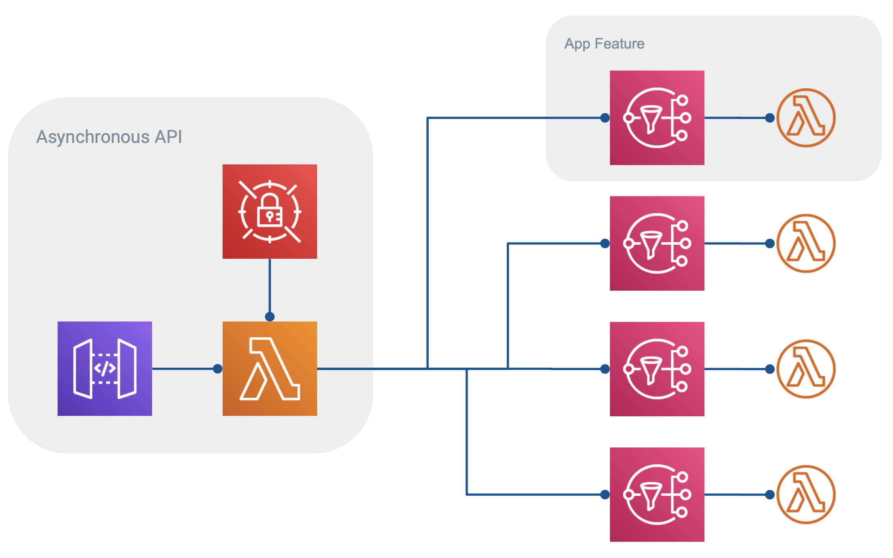

# Asynchronous Slackbot

A simple, asynchronous back end for your Slack app.

The app intentionally does very little: it is essentially middleware for [ExpressJS](https://expressjs.com) that accepts an incoming request, verifies its origin, and passes the request to a user-provided callback, where the payload is sent to a queue/trigger for asynchronous processing.

Endpoints are provided for:

- `/callbacks` publishes [interactive messages](https://api.slack.com/interactive-messages)
- `/events` publishes events from the [Events API](https://api.slack.com/events-api)
- `/oauth` completes the [OAuth2](https://api.slack.com/docs/oauth) workflow
- `/slash/:cmd` publishes [slash commands](https://api.slack.com/slash-commands)

In production it is expected that users will attach their own publishing functions to connect to a messaging service like [Amazon SNS](https://aws.amazon.com/sns/), or [Google Pub/Sub](https://cloud.google.com/pubsub/docs/).

## Advantages

- Separates the concerns of responding to incoming requests and the logic to handle them.
  - Handlers can be added/removed independently of this app; deploy once and forget.
  - Requests can be published to any platform.
  - Handlers can be written in any language supported by the topic trigger.
- Designed to work within serverless frameworks, such as [AWS Lambda](https://aws.amazon.com/lambda/) or [Google Cloud Functions](https://cloud.google.com/functions/docs/).
- Authenticates requests using Slack's [signing secrets](https://api.slack.com/docs/verifying-requests-from-slack) so you'll know that events published to internal triggers/queues are verified.

## Drawbacks

- Slack has a strict 3-second lifetime for many API operations, so it is critical that your asynchronous tasks complete quickly. Cold start times of some serverless computing platforms may be prohibitively slow.

## Serverless Deployment



Deploying a version of this app to Amazon Web Services (AWS) serverless offerings might take the above shape, where incoming requests from Slack to your app are handled as follows:

**API Gateway** receives and routes all requests using the catchall `/{proxy+}` resource and processed using a single **Lambda function** integration.

On cold starts, the **Lambda function** pulls its Slack tokens/secrets from its encrypted **SecretsManager** secret, starts a proxy express server, and publishes the request to an **SNS topic** where it is sorted and subscribers are notified.

On warm starts the environment and server are cached and the request is published to **SNS** without needing to re-fetch the app secrets.

Once the request &mdash; an OAuth request, a workspace event, a user-initiated callback, or a custom slash command &mdash; is published, the API responds to Slack with a `204 - No Content` status code.

If the topic does not exist, the API responds with a `400 - Bad Request` status code.

Using this method, each feature of your app can be added one-by-one independently of the API and is highly scalable.

## Topic Sorting

Requests from Slack are converted to JSON and assigned an `id` and `type` depending on the type and contents of the request. The general idea is to infer some kind of routing logic from the request.

The `type` field's value is taken from the path of the original request and will be one of `callback`, `event`, `oauth`, or `slash`.

The following table illustrates how the `type` and `id` field's respective values are calculated:

| Endpoint      | Type       | ID Recipe       |
|:------------- |:---------- |:--------------- |
| `/callbacks`  | `callback` | `$.callback_id` |
| `/events`     | `event`    | `$.event.type`  |
| `/oauth`      | `oauth`    | `null`          |
| `/slash/:cmd` | `slash`    | `:cmd`          |

## NodeJS Usage

At its core, `slackend` is middleware for [ExpressJS](https://expressjs.com) with several routes predefined for handling Slack messages. None of the routes are configured to respond to the request. This is done deliberately so users can customize the behavior of the app.

The Slack message and an inferred topic name are stored in the `res.locals` object and can be used to publish the request to your preferred messaging/queueing service.

Here is an example usage that simply logs the request to the console:

```javascript
const slackend = require('slackend');

// Create express app
const app = slackend({
  client_id:          process.env.SLACK_CLIENT_ID,
  client_secret:      process.env.SLACK_CLIENT_SECRET,
  oauth_error_uri:    process.env.SLACK_OAUTH_ERROR_URI,
  oauth_redirect_uri: process.env.SLACK_OAUTH_REDIRECT_URI,
  oauth_success_uri:  process.env.SLACK_OAUTH_SUCCESS_URI,
  signing_secret:     process.env.SLACK_SIGNING_SECRET,
  signing_version:    process.env.SLACK_SIGNING_VERSION,
  token:              process.env.SLACK_TOKEN,
});

// You *must* add a callback that responds to the request
app.use((req, res) => {
  console.log(res.locals);
  res.json({ok: true});
});
```

*WARNING &mdash; All of the configuration options to `slackend()` are optional, but omitting the `signing_secret` will disable the verification step where received requests are confirmed as originating from Slack. Disabling verification can also be done by setting the environmental variable `DISABLE_VERIFICATION=1`.*

## Local Development

Run a local instance of your slack app by cloning this repository, configuring settings, installing dependencies, and starting the express server.

Configure settings by copying [`.env.example`](./.env.example) to `.env` and adding your keys/settings.

```bash
cp .env.example .env
```

Install dependencies using `npm` or `docker-compose`:

```bash
npm install
# or
docker-compose run --rm npm install
```

Start the server:

```bash
npm start
```

Send a sample request:

```bash
# Callback
curl --request POST \
  --data 'payload=%7B%22callback_id%22%3A%22fizz%22%7D' \
  --url 'http://localhost:3000/callbacks'

# Event
curl --request POST \
  --header 'Content-Type: application/json' \
  --data '{"type": "event_callback", "event": {"type": "team_join"}}' \
  --url 'http://localhost:3000/events'

# Slash command
curl --request POST \
  --data 'fizz=buzz' \
  --url 'http://localhost:3000/slash/fizz'
```

## AWS

A module is provided to deploy to Lambda using SecretsManager to store the Slack secrets.

Example Lambda handler:

```javascript
const slackend = require('slackend/aws');
module.exports = slackend();
```

## Deploy with Terraform

Deploy directly to AWS using [`terraform`](https://terraform.io) and the [`slackbot`](https://github.com/amancevice/terraform-aws-slackbot) + [`slackbot-secrets`](https://github.com/amancevice/terraform-aws-slackbot-secrets) modules:


```hcl
module slackbot_secret {
  source               = "amancevice/slackbot-secrets/aws"
  kms_key_alias        = "alias/slack/your-kms-key-alias"
  secret_name          = "slack/your-secret-name"
  slack_bot_token      = "${var.slack_bot_token}"
  slack_client_id      = "${var.slack_client_id}"
  slack_client_secret  = "${var.slack_client_secret}"
  slack_signing_secret = "${var.slack_signing_secret}"
  slack_user_token     = "${var.slack_user_token}"

  // Optional additional secrets
  secrets {
    FIZZ = "buzz"
  }
}

module slackbot {
  source          = "amancevice/slackbot/aws"
  api_description = "My Slack REST API"
  api_name        = "<my-api>"
  api_stage_name  = "<my-api-stage>"
  secret_arn      = "${module.slackbot_secret.secret_arn}"
  kms_key_id      = "${module.slackbot_secret.kms_key_id}"
}
```
